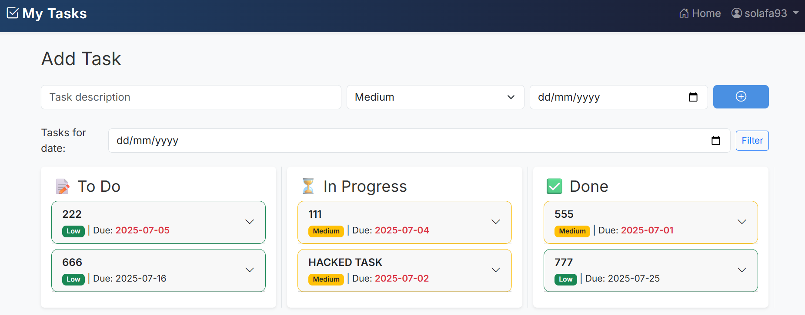
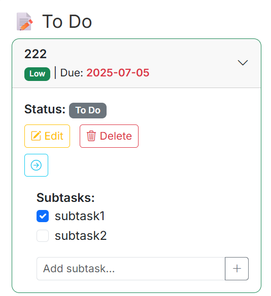

# 📝 Flask Task Manager

"This is a task manager built with Flask. I focused on clean user experience and intuitive task flow. Each task is categorized by status and priority. I used Bootstrap to build a Kanban-style layout, and Flask routes allow users to create, update, and manage their tasks easily. The project supports user accounts, date-based filtering, and dynamic status updates."
---

## 🚀 Features

- 🧑‍💼 User registration and login (Flask-Login)
- ✅ Add / update / delete your own tasks
- 📦 SQLite database with SQLAlchemy ORM
- 🎨 Responsive UI with Bootstrap 5
- 🔒 Password hashing with Werkzeug
- 🌐 Session management
- 🖼️ Icon support using Bootstrap Icons

---

## 🖼️ Screenshot

Register screen:

Login screen:

Tasks index:



---

## 📁 Folder Structure
flask-m/
│
├── static/
│ └── style.css
│
├── templates/
│ ├── base.html
│ ├── index.html
│ ├── login.html
│ ├── register.html
│ └── edit.html
│
├── instance
│ ├── tasks.db # SQLite database
├── app.py # Main application
├── README.md
├── Dockerfile
└── requirements.txt
## 🧰 Technologies Used

- Python 3.11+
- Flask
- Flask-Login
- Flask-SQLAlchemy
- SQLite
- Bootstrap 5
- Bootstrap Icons

---

## ⚙️ Setup Instructions

1. **Clone the repository:**

```bash
git clone https://github.com/yourusername/flask-task-manager.git
cd flask-task-manager
